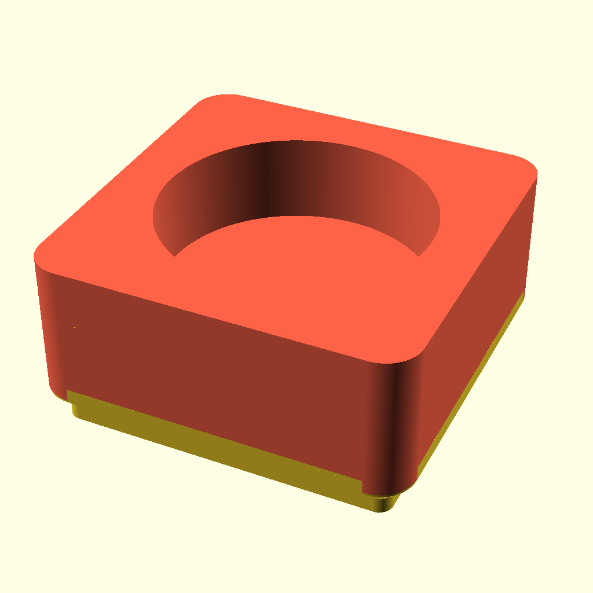
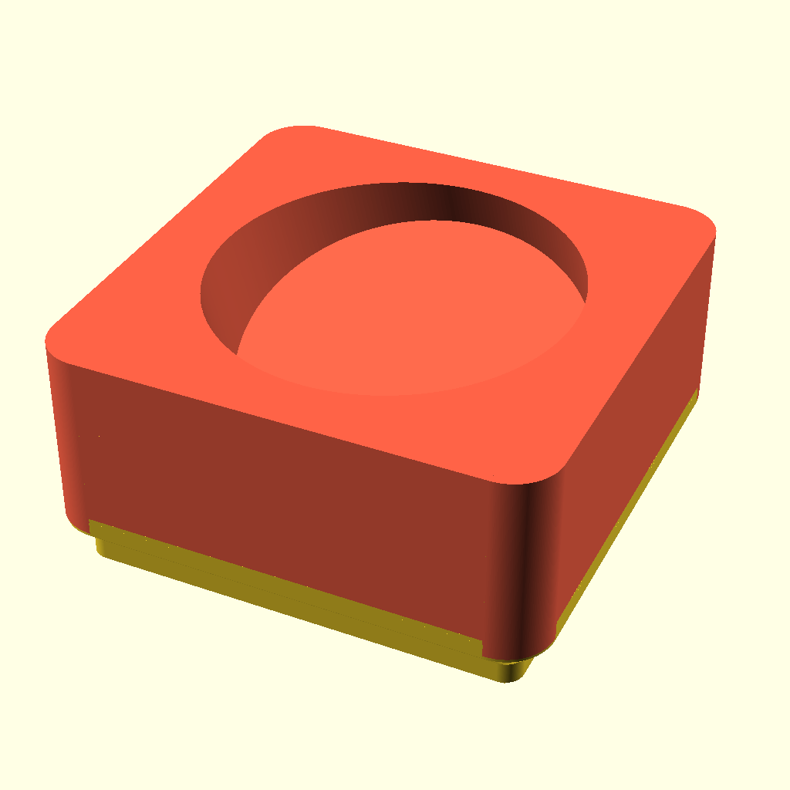
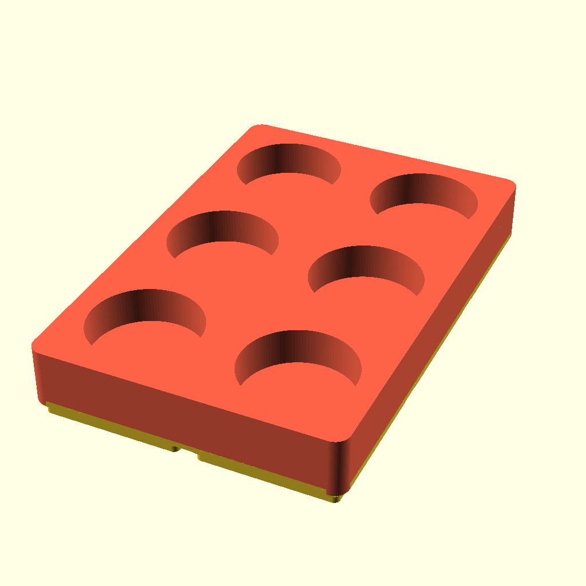

# nuun-storage-bin
A 3D printable bin for storing NUUN tubes ([NUUN Hydration](https://nuunlife.com/) | [NUUN Hydration Canada](https://nuunlife.ca/)), using [Gridfinity Rebuilt OpenSCAD](https://github.com/kennetek/gridfinity-rebuilt-openscad/) for the base bin generation.

Left: 1 by 1 with 0º rotation and a quality of 256: `generate.sh -o 1x1r0 -q 256`

Right: 1 by 1 with 20º rotation and a quality of 256: `generate.sh -o 1x1r20 -r 20 -q 256`

Left: 2 by 3 with 0º rotation and a quality of 128: `generate.sh -o 2x3r0 -x 2 -y 3 -q 128`

Right: 2 by 3 with 20º rotation and a quality of 128: `generate.sh -o 2x3r20 -x 2 -y 3 -r 20 -q 128`

[Gridfinity](https://www.youtube.com/watch?v=ra_9zU-mnl8) by [Zack Freedman](https://www.youtube.com/c/ZackFreedman/about)
