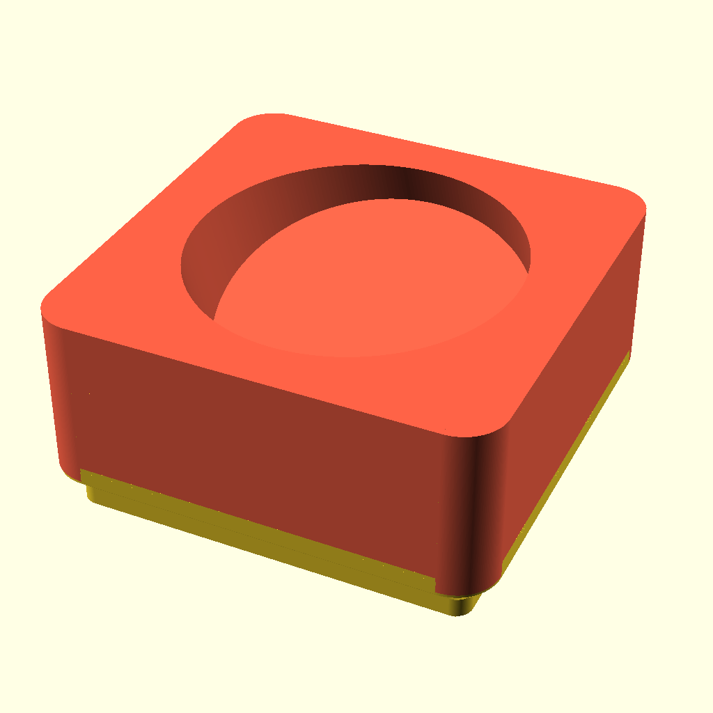
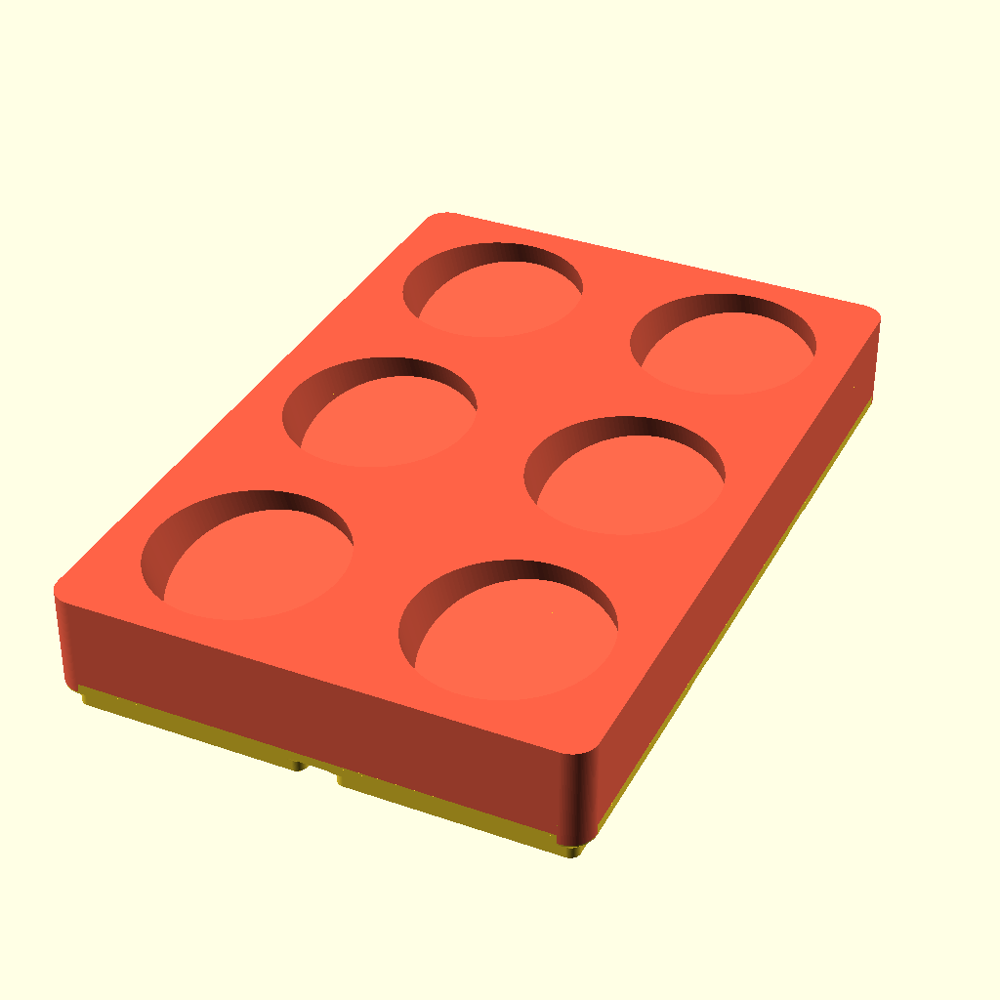

# nuun-storage-bin
A 3D printable bin for storing NUUN tubes ([NUUN Hydration](https://nuunlife.com/) | [NUUN Hydration Canada](https://nuunlife.ca/)), using [Gridfinity Rebuilt OpenSCAD](https://github.com/kennetek/gridfinity-rebuilt-openscad/) for the base bin generation.

[Gridfinity](https://www.youtube.com/watch?v=ra_9zU-mnl8) by [Zack Freedman](https://www.youtube.com/c/ZackFreedman/about)
